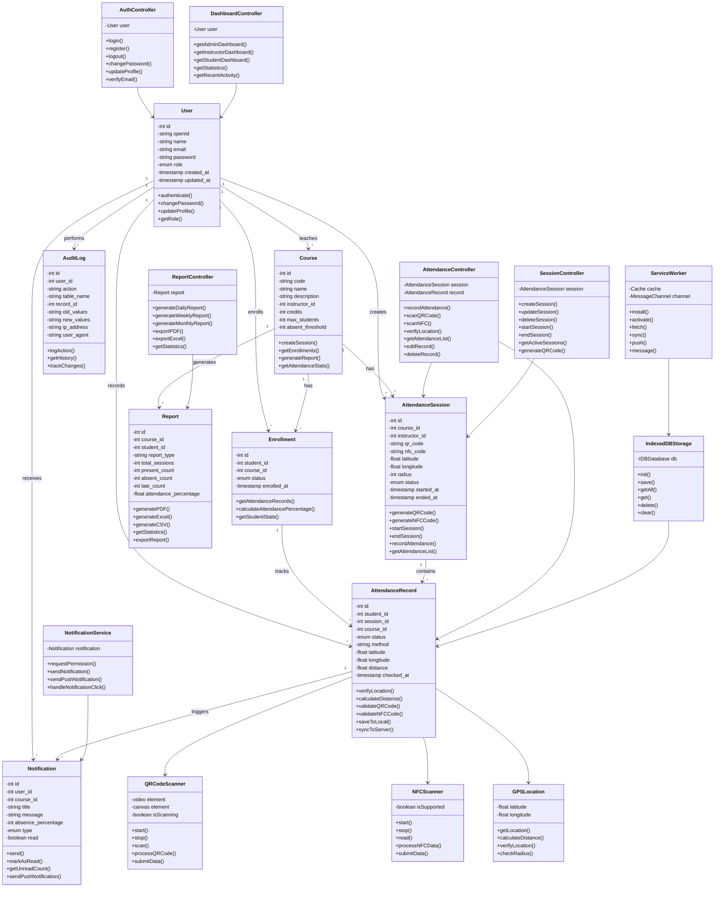

# Class Diagram
## Attendance Management System Architecture



---

## Class Descriptions

### Model Classes

#### User
Represents system users with different roles (admin, instructor, student).
- **Attributes:** id, openId, name, email, password, role, timestamps
- **Methods:** authenticate, changePassword, updateProfile, getRole

#### Course
Represents academic courses with attendance settings.
- **Attributes:** id, code, name, description, instructor_id, credits, max_students, absent_threshold
- **Methods:** createSession, getEnrollments, generateReport, getAttendanceStats

#### Enrollment
Tracks student enrollment in courses.
- **Attributes:** id, student_id, course_id, status, enrolled_at
- **Methods:** getAttendanceRecords, calculateAttendancePercentage, getStudentStats

#### AttendanceSession
Represents a single attendance session with QR/NFC codes.
- **Attributes:** id, course_id, instructor_id, qr_code, nfc_code, location, radius, status, timestamps
- **Methods:** generateQRCode, generateNFCCode, startSession, endSession, recordAttendance, getAttendanceList

#### AttendanceRecord
Individual attendance records with GPS verification.
- **Attributes:** id, student_id, session_id, course_id, status, method, location, distance, checked_at
- **Methods:** verifyLocation, calculateDistance, validateQRCode, validateNFCCode, saveToLocal, syncToServer

#### Notification
System notifications for absence warnings and reminders.
- **Attributes:** id, user_id, course_id, title, message, absence_percentage, type, read
- **Methods:** send, markAsRead, getUnreadCount, sendPushNotification

#### Report
Generated attendance reports in multiple formats.
- **Attributes:** id, course_id, student_id, report_type, statistics, attendance_percentage
- **Methods:** generatePDF, generateExcel, generateCSV, getStatistics, exportReport

#### AuditLog
Tracks all system changes and user actions.
- **Attributes:** id, user_id, action, table_name, record_id, old_values, new_values, ip_address, user_agent
- **Methods:** logAction, getHistory, trackChanges

---

### Controller Classes

#### AuthController
Handles user authentication and profile management.
- **Methods:** login, register, logout, changePassword, updateProfile, verifyEmail

#### DashboardController
Manages dashboard views for different roles.
- **Methods:** getAdminDashboard, getInstructorDashboard, getStudentDashboard, getStatistics, getRecentActivity

#### AttendanceController
Handles attendance recording and verification.
- **Methods:** recordAttendance, scanQRCode, scanNFC, verifyLocation, getAttendanceList, editRecord, deleteRecord

#### SessionController
Manages attendance sessions.
- **Methods:** createSession, updateSession, deleteSession, startSession, endSession, getActiveSessions, generateQRCode

#### ReportController
Generates and exports reports.
- **Methods:** generateDailyReport, generateWeeklyReport, generateMonthlyReport, exportPDF, exportExcel, getStatistics

---

### Service Classes

#### QRCodeScanner
Handles QR code scanning from camera.
- **Attributes:** video element, canvas element, isScanning flag
- **Methods:** start, stop, scan, processQRCode, submitData

#### NFCScanner
Handles NFC tag reading.
- **Attributes:** isSupported flag
- **Methods:** start, stop, read, processNFCData, submitData

#### GPSLocation
Handles GPS location verification.
- **Attributes:** latitude, longitude
- **Methods:** getLocation, calculateDistance, verifyLocation, checkRadius

#### IndexedDBStorage
Handles local data storage for offline support.
- **Attributes:** IDBDatabase instance
- **Methods:** init, save, getAll, get, delete, clear

#### ServiceWorker
Handles PWA functionality and offline support.
- **Attributes:** Cache instance, MessageChannel
- **Methods:** install, activate, fetch, sync, push, message

#### NotificationService
Handles push notifications and alerts.
- **Attributes:** Notification instance
- **Methods:** requestPermission, sendNotification, sendPushNotification, handleNotificationClick

---

## Design Patterns Used

| Pattern | Usage |
|---------|-------|
| **MVC** | Model-View-Controller architecture |
| **Repository** | Data access abstraction |
| **Service** | Business logic encapsulation |
| **Singleton** | Database and cache instances |
| **Observer** | Event handling and notifications |
| **Factory** | Object creation |
| **Strategy** | Multiple attendance verification methods |

---

## Architecture Layers

```
┌─────────────────────────────────────┐
│     Presentation Layer (Views)      │
│  HTML/CSS/JavaScript UI Components  │
└─────────────────────────────────────┘
                  ↓
┌─────────────────────────────────────┐
│    Application Layer (Controllers)  │
│  Business Logic & Request Handling  │
└─────────────────────────────────────┘
                  ↓
┌─────────────────────────────────────┐
│      Domain Layer (Models)          │
│  Core Business Entities & Rules     │
└─────────────────────────────────────┘
                  ↓
┌─────────────────────────────────────┐
│    Data Access Layer (Repository)   │
│  Database Operations & Queries      │
└─────────────────────────────────────┘
                  ↓
┌─────────────────────────────────────┐
│    Infrastructure Layer (Services)  │
│  External Services & Utilities      │
└─────────────────────────────────────┘
```

---

## Interaction Flow

### Attendance Recording Flow
```
Student → QRCodeScanner → AttendanceRecord → GPSLocation → Verification
                                                    ↓
                                            AttendanceController
                                                    ↓
                                            IndexedDBStorage
                                                    ↓
                                            ServiceWorker (Sync)
                                                    ↓
                                            Server Database
                                                    ↓
                                            Notification Service
```

### Report Generation Flow
```
ReportController → Report Model → Database Query → Data Aggregation
                                                    ↓
                                            Statistics Calculation
                                                    ↓
                                            PDF/Excel Generation
                                                    ↓
                                            File Export
```

---

## Technology Stack

| Layer | Technology |
|-------|-----------|
| **Backend** | Laravel 10+ |
| **Database** | SQLite/MySQL |
| **Frontend** | HTML5, CSS3, JavaScript ES6+ |
| **PWA** | Service Worker, Web APIs |
| **QR Code** | QR Code Scanner Library |
| **NFC** | Web NFC API |
| **GPS** | Geolocation API |
| **Storage** | IndexedDB |
| **Notifications** | Push API |

---

## Security Considerations

✅ **Authentication:** Secure login with password hashing
✅ **Authorization:** Role-based access control (RBAC)
✅ **Data Validation:** Input validation and sanitization
✅ **CSRF Protection:** Token-based CSRF protection
✅ **Audit Trail:** Complete audit logging
✅ **GPS Verification:** Location-based verification
✅ **QR Code Security:** Unique codes per session
✅ **Encryption:** Data encryption in transit and at rest
