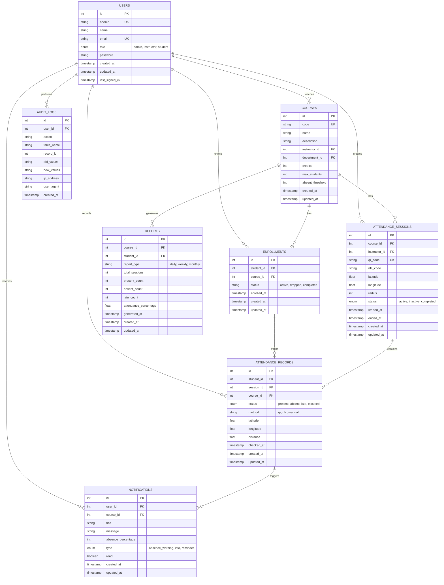

# Entity-Relationship Diagram (ERD)
## Attendance Management System Database Schema

---

## Database Schema Details

### Users Table
- **Primary Key:** id
- **Unique Keys:** openId, email
- **Roles:** admin, instructor, student
- **Purpose:** Store user authentication and profile information

### Courses Table
- **Primary Key:** id
- **Unique Key:** code
- **Foreign Keys:** instructor_id (Users), department_id
- **Purpose:** Store course information and settings

### Enrollments Table
- **Primary Key:** id
- **Foreign Keys:** student_id (Users), course_id (Courses)
- **Status:** active, dropped, completed
- **Purpose:** Track student enrollment in courses

### Attendance Sessions Table
- **Primary Key:** id
- **Unique Key:** qr_code
- **Foreign Keys:** course_id (Courses), instructor_id (Users)
- **Purpose:** Store attendance session details with QR/NFC codes

### Attendance Records Table
- **Primary Key:** id
- **Foreign Keys:** student_id (Users), session_id (AttendanceSessions), course_id (Courses)
- **Status:** present, absent, late, excused
- **Method:** qr, nfc, manual
- **Purpose:** Store individual attendance records with GPS verification

### Notifications Table
- **Primary Key:** id
- **Foreign Keys:** user_id (Users), course_id (Courses)
- **Type:** absence_warning, info, reminder
- **Purpose:** Store notification history and absence warnings

### Reports Table
- **Primary Key:** id
- **Foreign Keys:** course_id (Courses), student_id (Users)
- **Report Types:** daily, weekly, monthly
- **Purpose:** Store generated attendance reports

### Audit Logs Table
- **Primary Key:** id
- **Foreign Key:** user_id (Users)
- **Purpose:** Track all system changes and user actions

---

## Relationships Summary

| Relationship | Type | Description |
|---|---|---|
| Users → Courses | 1:N | One instructor teaches many courses |
| Users → Enrollments | 1:N | One student enrolls in many courses |
| Users → Attendance Sessions | 1:N | One instructor creates many sessions |
| Users → Attendance Records | 1:N | One student has many attendance records |
| Users → Notifications | 1:N | One user receives many notifications |
| Users → Audit Logs | 1:N | One user performs many actions |
| Courses → Enrollments | 1:N | One course has many enrollments |
| Courses → Attendance Sessions | 1:N | One course has many sessions |
| Courses → Reports | 1:N | One course generates many reports |
| Enrollments → Attendance Records | 1:N | One enrollment tracks many records |
| Attendance Sessions → Attendance Records | 1:N | One session contains many records |
| Attendance Records → Notifications | 1:N | One record triggers many notifications |

---

## Key Features

✅ **Normalization:** Database is normalized to 3NF
✅ **Referential Integrity:** All foreign keys maintain data integrity
✅ **Timestamps:** All tables have created_at and updated_at
✅ **Audit Trail:** Audit logs track all changes
✅ **Status Tracking:** Enum fields for status management
✅ **GPS Verification:** Latitude, longitude, and distance fields
✅ **QR/NFC Support:** Unique codes for attendance verification
✅ **Scalability:** Design supports large-scale deployments
